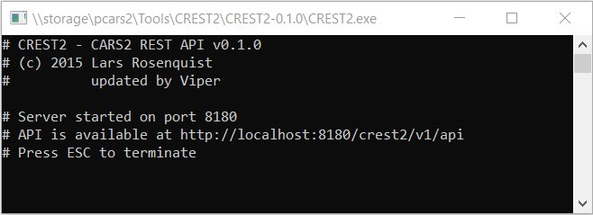
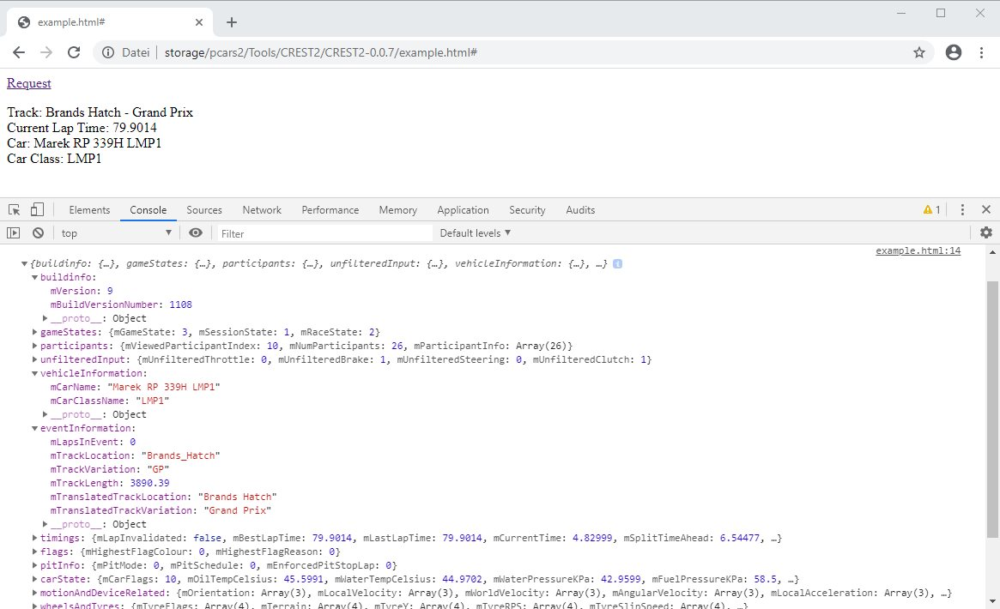

# README #

First of all this Repository is a copy from here: https://github.com/NLxAROSA/CREST/tree/CREST2

Thanks Lars for his hard work, but he is no longer developing the project and I hope a can update it to the current Shared Memory Version.

# Introducing CREST2 - also known as the CARS2 REST API #

This project provides a way for developers to have access to the data provided by Project CARS 2 Shared Memory in a more portable and accessible format than a mapped memory file.

It's a windows native command line application (written in C++ and a fair bit of plain old C) that will act as a local web/application server and serve the data via JSON over HTTP by accessing a URL.

Any web browser or HTTP client will be able to access the data both locally and inside the local network, which facilitates easy add-on development in any language (e.g. JavaScript, Java, C, C++, C#, etc. etc.) and platform (e.g. web browser, iOS, Android, Windows Phone or other) with a vast array of client REST libraries at your disposal.\
If you want to see what you can do with it, then look here: [Project CARS Dedicated Server live view (also supports CREST2)](https://github.com/eckhchri/pcars-ds-liveview/blob/master/README.md)

* See https://www.projectcarsgame.com/ for more info on Project CARS.
* Latest binary download is always available at https://drive.google.com/drive/folders/1zx12hGJttkTa0aG1jIO9AZ28VM7cDj-J

# Running CREST2

1. Download the zip archive from https://drive.google.com/drive/folders/1zx12hGJttkTa0aG1jIO9AZ28VM7cDj-J and extract it, or build it yourself -> look at the topic [Building from source](#building-from-source).  
The archive includes the following relevant files:
```
CREST2.exe		- Binary
zlibwapi.dll		- Library for data compression
crest2.json		- Example how the browser output looks like
crest2_formatted.json	- Example how the browser output looks like - formatted for better readability
example.html		- Example how you can use the API in HTML
Readme.txt		- Basic info how to use it
```
&nbsp;&nbsp;&nbsp;&nbsp;&nbsp;&nbsp;&nbsp;There are some [screenhots](#screenshots) below, where you can see how the outputs look like.

2. Start the application by double-clicking the CREST2.exe.
3. Windows will complain about security (coming from an unknown/unverified source) both when downloading and starting the application. Please allow/unblock the application in order to allow it to start. Windows Firewall will also ask for permission to access the local network. Please allow it access for proper functioning.
4. If Windows complains about missing DLLs (e.g. MSVCR120.DLL or similar), please download and install the Visual C++ Redistributable Packages for Visual Studio 2019 from https://www.visualstudio.com/de/downloads/ (vcredist_x86.exe, scroll down to "Other Tools and Frameworks"), then start again.
5. Console will show a notification about the server being up and running and display port and URL information.

# Connecting to Project CARS 2

1. Start Project CARS 2.
2. Enable Shared Memory "Project CARS2" mode in the settings
3. Open up a browser (Chrome for best results) and go to http://localhost:8180/crest2/v1/api or for better readability to http://localhost:8180/crest2/v1/api?formatted=true
4. Profit! F5/Refresh until you drop!


# Advanced usage

The basic URL (http://localhost:8180/crest2/v1/api) will expose the full set of data. If parameters are added to the request URL, the set will be limited to the parameters you specify.

The following parameters are available:

1. buildInfo
2. gameStates
3. participants
4. unfilteredInputs
5. vehicleInformation
6. eventInformation
7. timings
8. flags
9. pitInfo
10. carState
11. motionDeviceRelated
12. wheelsAndTyres
13. carDamage
14. weather
15. formatted

Example:  http://localhost:8180/crest2/v1/api?buildInfo=true will give you just the buildInfo.

Example2: http://localhost:8180/crest2/v1/api?timings=true&carState=true&weather=true will give you timings, carState and weather.

Example3: http://localhost:8180/crest2/v1/api will give you the full set.

NOTE: Sections are always in the order listed, never in the order of the request parameters.

# Command Line Options
```
CREST2.exe [-p 8180] [-t 17] [-d[d]] [-h]
  -p    TCP Port, default: 8180, allowed: 1025-65534
  -t    Websocket Timeout im ms, default: 17, allowed: 1-10000
  -d    Debug Level 1, show some more info for Integrity Checks
  -dd   Debug Level 2, show more info for Integrity Checks
  -h    Help
```
The Websocket Timeout is the timeout for the winsock select() function which is used by the Mongoose Library. It returns the number of ready socket handles. The timeout is the maximum time for the select function to wait.\
Changing the value seems to have no effect, but maybe someone finds a use case where it is relevant.

# Screenshots
**CREST2.exe**\


**Browser Output default (Chrome)**\
  

**Browser Output formatted (Chrome)**\
  

**HTML Example opened in Chrome**\
If you open the example.html, open the developer console and click on Request, you will get some selected values in the browser window and the complete array of Shared Memory data in the developer console, where you can find all variables for use in your own code:  



# Compression

CREST can gzip the response body. Just add the following header to the HTTP request: "Accept-Encoding: gzip" and CREST will gzip the response and set the "Content-Encoding: gzip" HTTP response header. Regardless of the header, CREST will not compress output if the response is smaller than 128 bytes, to prevent overhead.

# Building from source

1. Download the source code
2. Open it up in Visual Studio 2019

The project won't build without the proper setup of zlib. To properly enable zlib:
1. Download and extract the source code from http://www.zlib.net (Used http://zlib.net/zlib1211.zip)
2. Extract and open .\contrib\vstudio\vc14\zlibvc.sln with Visual Studio
3. Compile as Release and you will find 2 files in the folder .\contrib\vstudio\vc14\x86\ZlibDllRelease:
- zlibwapi.lib - copy this file to the CREST2 source into the folder CREST2\lib
- zlibwapi.dll - After compiling CREST2 this file must be parallel to your CREST2.exe
